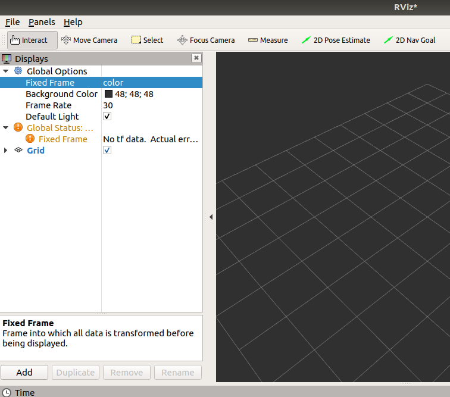
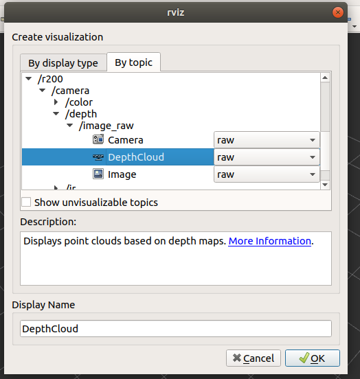

# OpenManipulator_with_IntelRealSense_GazeboPlugin
### pre-requirements to be installed
* Ros-melodic
* catkin
### To setup the catkin workspace follow the commads
1. create a folder catkin_ws \
  `mkdir catkin_ws && cd catkin_ws`
2. create a src directory \
   `mkdir src && cd src`
3. clone the repository in the src \
   `git clone https://github.com/aku98/OpenManipulator_with_IntelRealSense_GazeboPlugin.git`
4. go to the catkin_ws repository and build the files \
   `cd ~/catkin_ws && catkin make`
### How to run
1. open a terminal and setup the source for the workspace \
   `cd ~/catkin_ws/devel && source setup.sh`
2. run the launch file for openmanipulator controller and sepcify value for platform parameter to use in gazebo  \
   `roslaunch open_manipulator_controller open_manipulator_controller.launch use_platform:=false`
3. in another terminal launch the gazebo simulator with bot and camera \
   empty world \
   `roslaunch open_manipulator_gazebo open_manipulator_gazebo.launch` \
   world with objects \
   `roslaunch open_manipulator_gazebo open_manipulator_gazebo_table.launch`
4. start the simulation by clicking the play button at the bottom in gazebo simulator
5. to operate the openManipulator bot using keyboard 
   `roslaunch open_manipulator_teleop open_manipulator_teleop_keyboard.launch`
### To monitor the depth data using Rviz
1. open rviz in another terminal \
`rosrun rviz rviz` 
2. set the **fixed frame** id to **color** under the global option \
  
3. subscribe to the depth data by adding DepthCloud Bytopic \
 
### To record the depth data in rosbag
1. create a directory for rosbag file\
  `mkdir rosbag_files && cd rosbag_files`
2. After following the steps to launch the siimulator run this command in new terminal\
  `rosbag record -a`\
   this will record all the data from all the topics published by ros master\
   \
   To record the specific topic mention them instead of **-a** in the above command\
   \
   all the published topics can be viewed using the command\
   `rostopc list`
